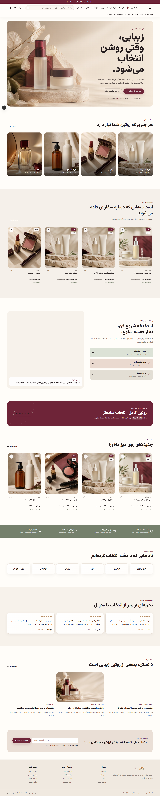
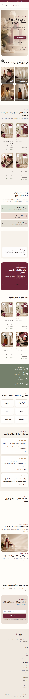

# Mahvara Storefront

[](https://github.com/Alivexor/mahvara-store/actions/workflows/quality.yml)
[](https://github.com/Alivexor/mahvara-store/releases)
[](#license)

**Languages:** [English](README.md) · [فارسی](README.fa.md)

Mahvara is a full-stack, Persian-language storefront for beauty and skincare products. It is designed RTL-first and combines a polished shopping experience with a database-backed commerce workflow, customer accounts, protected administration, and a mock payment flow for safe local development.

> This repository is a product foundation and demo. It must not process real payments or be presented as a live store until the production checklist below has been completed.

| Desktop | Mobile |
| --- | --- |
|  |  |

## Highlights

- Persian and RTL-first interface with responsive desktop and mobile layouts
- Product catalogue with URL-based search, filtering, sorting, stock state, and pricing
- Product pages with image galleries, reviews, related products, wishlist support, and recently viewed items
- Local cart, validated checkout, server-side totals, coupon validation, transactional inventory reservation, and order creation
- Payment-provider abstraction with a safe mock provider, payment verification, duplicate-callback handling, and stock settlement
- Registration, login, logout, hashed passwords, database sessions, password-reset token architecture, and role-based access control
- Customer account pages for orders, addresses, profile, and wishlist
- Protected administration for products, orders, and operational data views
- Static information pages, contact and newsletter forms, blog, SEO metadata, JSON-LD, sitemap, robots, manifest, and product feed
- Prisma schema, migrations, seed data, Docker setup, automated quality gates, and browser QA coverage

## Technology

- Next.js 16 App Router and React 19
- TypeScript with strict type checking
- Tailwind CSS 4
- PostgreSQL and Prisma ORM
- Zod validation and bcrypt password hashing
- Vitest for unit tests and Playwright Core for browser QA

## Project structure

```text
app/           Routes, pages, metadata, and route handlers
components/    Shared UI, layout, and administration components
features/      Client-side commerce, catalogue, cart, and auth interactions
lib/           Database, security, authentication, payment, and domain helpers
services/      Application use cases, including order creation
schemas/       Zod request and form schemas
prisma/        Schema, migrations, and seed script
public/        Brand assets and product images
tests/         Unit tests for commerce, cart/inventory, auth, and payment logic
docs/          Brand notes, research, and QA screenshots
scripts/       Browser QA runner
```

## Prerequisites

- Node.js 20.9 or newer
- npm
- PostgreSQL 17, or Docker Desktop for the provided Compose setup

## Local setup

1. Install dependencies.

   ```bash
   npm ci
   ```

2. Create your local environment file.

   ```powershell
   Copy-Item .env.example .env
   ```

3. Start PostgreSQL. With Docker, you can start only the database:

   ```bash
   docker compose up -d postgres
   ```

4. Update `DATABASE_URL` and generate a unique `AUTH_SECRET` in `.env`.

   ```bash
   openssl rand -base64 32
   ```

5. Generate Prisma Client, apply migrations, and load the sample data.

   ```bash
   npm run db:generate
   npm run db:migrate
   npm run db:seed
   ```

   On Windows, stop a running `next dev` process before `npm run db:generate`; the development server can hold Prisma's query-engine file open.

6. Start the development server and open [http://localhost:3000](http://localhost:3000).

   ```bash
   npm run dev
   ```

The seed creates sample products plus demo customer and administrator accounts. The values are defined in `.env.example`; change them before any shared or production deployment. The seed command refuses the bundled default passwords when `NODE_ENV=production`.

## Environment variables

Copy `.env.example` rather than creating an environment file from scratch. The primary variables are:

| Variable | Purpose |
| --- | --- |
| `DATABASE_URL` | PostgreSQL connection string |
| `AUTH_SECRET` | Long, unique secret used by security helpers |
| `SESSION_COOKIE_NAME` | Name of the HTTP-only session cookie |
| `NEXT_PUBLIC_APP_URL` | Canonical public application URL |
| `PAYMENT_PROVIDER` | `mock` locally; replace only after implementing a real provider adapter |
| `PAYMENT_CALLBACK_URL` | Absolute callback URL registered with the payment provider |
| `DEMO_ADMIN_*`, `DEMO_CUSTOMER_*` | Seed credentials; never use the defaults in production |
| `RATE_LIMIT_WINDOW_MS`, `RATE_LIMIT_MAX` | In-memory abuse-control defaults |
| `NEXT_PUBLIC_INSTAGRAM_URL`, `NEXT_PUBLIC_TELEGRAM_URL` | Optional owned social-profile URLs |

`.env` is intentionally ignored by Git. Never commit credentials, payment keys, a production database URL, or customer data.

## Quality checks

Run the following before opening a pull request or publishing a release:

```bash
npm run lint
npm run typecheck
npm test
npm run build
```

To run the browser QA suite, start the app on port `3010` in one terminal, then run the QA command in another:

```bash
npm run dev -- --port 3010
npm run qa:browser
```

The browser runner checks key routes at desktop and mobile viewports, detects horizontal overflow, reports browser-console errors, and refreshes the home-page screenshots under `docs/screenshots/`.

GitHub Actions runs Prisma Client generation, linting, type checking, unit tests, and a production build on pushes and pull requests targeting `main`.

## Docker

For a containerized application and database:

```bash
docker compose up --build
```

Before using this outside a local environment, set a strong `AUTH_SECRET`, a non-default `POSTGRES_PASSWORD`, and the final `NEXT_PUBLIC_APP_URL` in your environment. The application container applies Prisma migrations before starting Next.js.

## Commerce and payment behavior

The client only submits product IDs and quantities. Prices, promotions, stock availability, shipping, and totals are recalculated on the server. During order creation, inventory is reserved in a serializable database transaction. A successful payment verification settles the reservation and marks the order as paid; a failed verification releases the reservation and any coupon usage.

The bundled payment provider is deliberately a mock. A real provider integration must verify every callback server-to-server, validate the provider's signature or authority, use the provider's documented amount units, and be tested with the provider's sandbox before it is enabled.

## Production checklist

- Provision managed PostgreSQL with backups and encrypted connections.
- Set a strong, secret `AUTH_SECRET`; use unique non-demo administrator credentials.
- Configure a real payment provider, email delivery service, domain, TLS, and owner-controlled social links.
- Replace the in-memory rate limiter with shared storage such as Redis when running multiple instances.
- Configure object storage/CDN before accepting uploaded administration assets.
- Review cookie settings, CSP, security headers, monitoring, error reporting, and database retention policies for the selected host.
- Perform independent accessibility, performance, load, and security testing.

## Documentation

- [Brand and design notes](docs/BRAND.md)
- [UX research](docs/RESEARCH.md)
- [Project status](PROJECT_STATUS.md)
- [Contributing guide](CONTRIBUTING.md)
- [Security policy](SECURITY.md)

## License

No open-source license has been selected for this repository. Until the owner adds one, the code and assets are not licensed for reuse. Choose an appropriate license before accepting public contributions or distributing the project.
